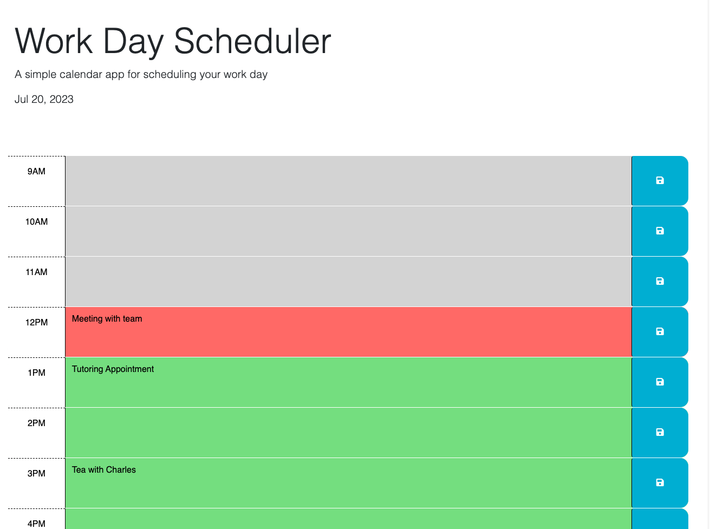

# Work Day Scheduler App

## Description
This app is built as a simple way to schedule ones 9-5 work day. It uses local storage on the user's machine to save the schedule.
the colors will automatically change based on the time of day. My motivation for building this project was to familiarize myself more with Javascript, JQuery, and the ability to use 3rd party API's. Another motivation was to see how calendar apps work. The calendar app is something I use a lot on my phone and computer, and having a better understanding of how complex they are is really important. During this project I learned a lot about how to use Jquery, how to problem-solve and debug my code in the console log, and also comparisons, specifically having to convert  strings to numbers for them to work properly.

## Installation

If you want to try this out on your local machine feel free to clone the repository and check out my code as well as run it in your browser. 

## Usage

This app is fairly simple. When the webpage loads it will check if you have used it before by getting the localStorage from your browser, if so, the appointments you scheduled should have already populated. If not, all of the time-blocks will be blank. To make an appointment you should click on the time block you want, this will allow you to type your appointment in. In order to save it press the icon on the left that shows the save icon. (an OG floppy disk).

## Collaborators

This app was built by me, Nicholas Burr, however I did have some help with starter code provided by the EDX2U bootcamp. Additionally I had help from Trevor Oveson, one of my course Teaching Assistants learning about template literals. I also recieved some general code suggestions and debugging help from the askBCS staff at EDX2U, specifically with putting items into localStorage from pressing the save button. 

Finally I used Jquery, as well as DayJS on this application. 

